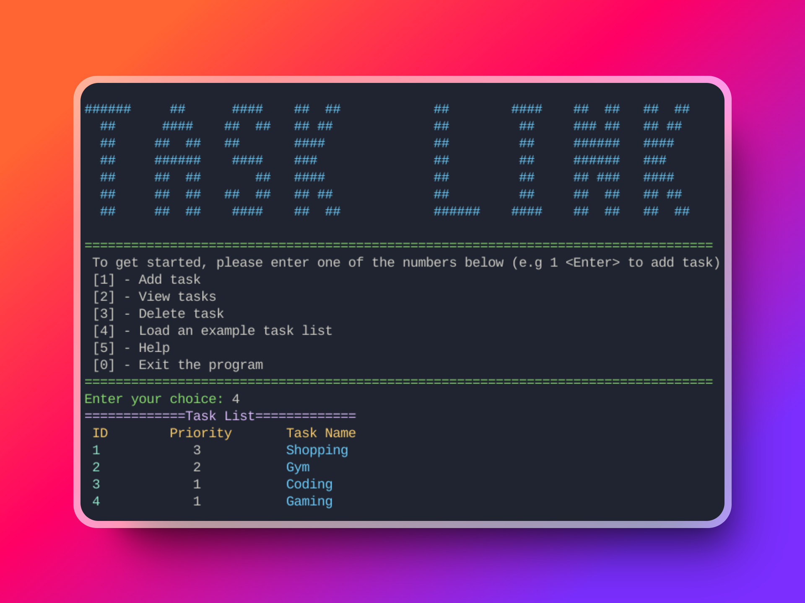

## Table of Contents

1. [Description](#description)
1. [Design](#design)
1. [Features](#features)
1. [Technologies Used](#technologies-used)

## Description

The purpose of this project is to manage tasks based on priority. I created this to practice my skills in linked list data structure.

## Design

## Features

- Add task
- View task
- Delete task

## Technologies Used

- C++ 